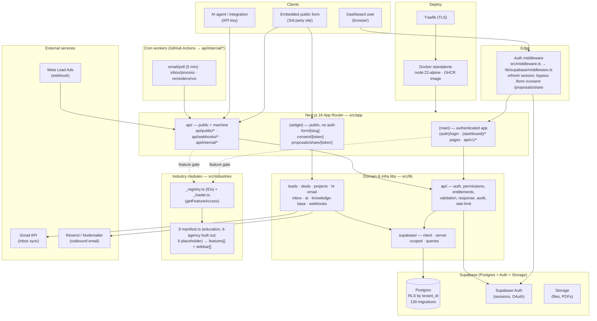

# Architecture

How EdgeX is put together: one Next.js app split into route groups, a thin auth-refresh middleware, Supabase as the whole backend, an industry-module registry that gates features, cron workers hitting internal endpoints, and a Docker/Traefik deploy.

## Anchors
- Route groups: `src/app/(main)/`, `src/app/(widget)/`, `src/app/api/`
- Middleware: `src/middleware.ts`, `src/lib/supabase/middleware.ts`
- Industry gate: `src/industries/_registry.ts`, `src/industries/_loader.ts`, `src/industries/*/manifest.ts`
- Supabase clients: `src/lib/supabase/{client,server,scoped,queries}.ts`
- Cron targets: `src/app/api/internal/{email/poll,inbox/process,reminders/run}`; workflows in `.github/workflows/*.yml`
- Deploy: `Dockerfile`, `docker-compose.prod.yml`, `docs/dev-collab/DEV-WORKFLOW-AND-DEPLOYMENT.md`
