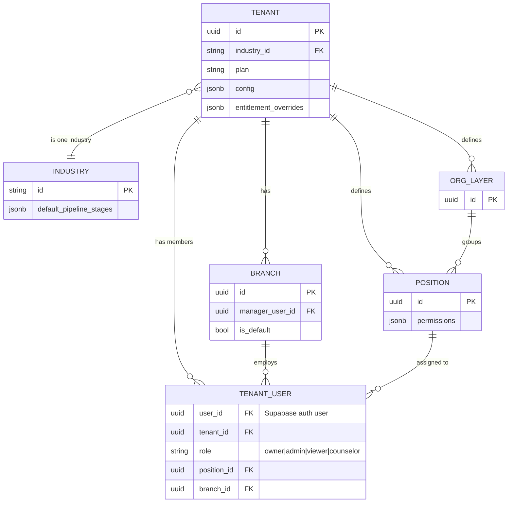
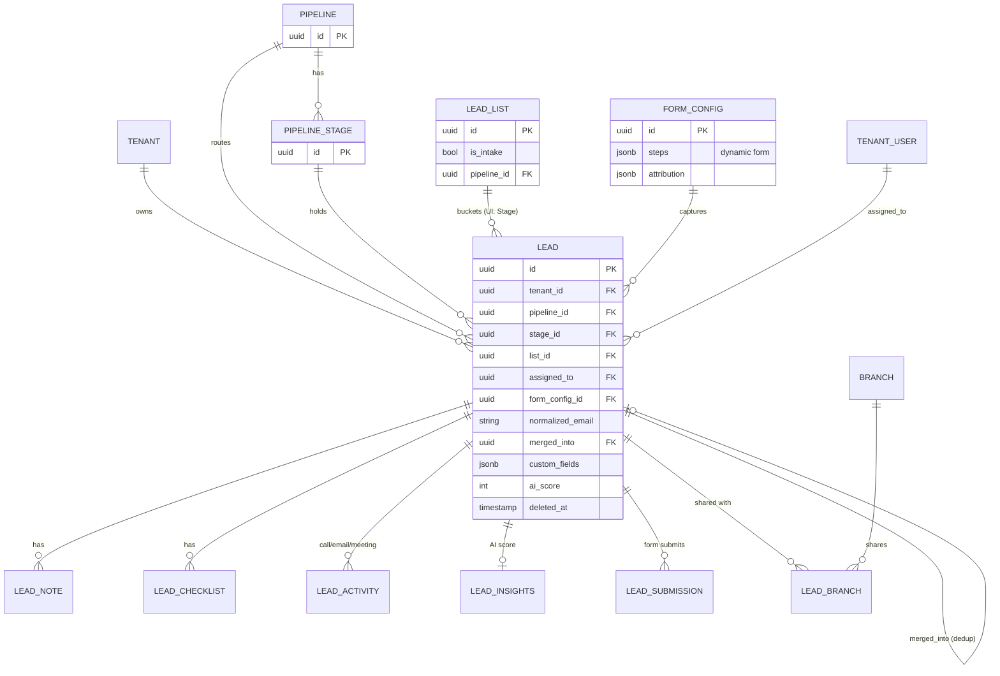
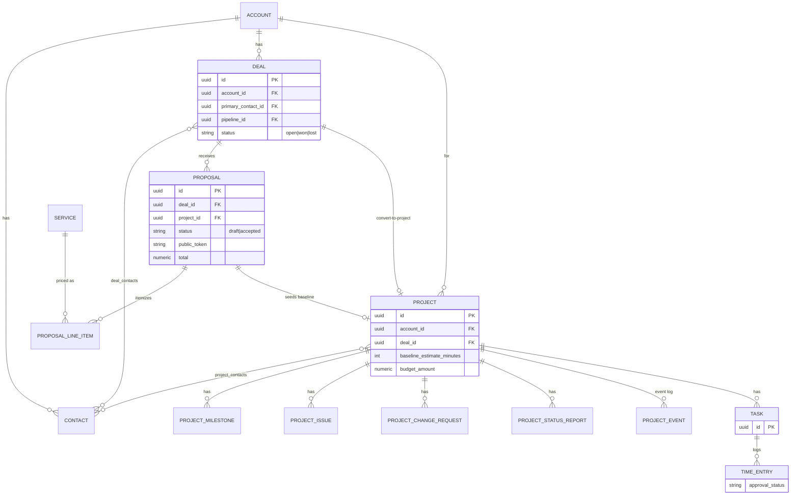

# Data Model

Core entities and relationships, split into four readable views. Source of truth: `src/types/database.ts` (every interface) and `supabase/migrations/*.sql` (DDL / foreign keys). Note: the UI labels **LeadList** as "Stage".

## A. Tenancy spine

Every tenant table carries `tenant_id` and is isolated by Row-Level Security. `tenant_users` is the auth pivot — it joins a Supabase auth user to a tenant with a role, position, and branch.



## B. Leads core (universal)

The `leads` table is the central object across every industry. A lead sits in a pipeline + stage, optionally in a UI "Stage" (LeadList), and can be shared across branches. Submissions and merges support dedup.



## C. IT-agency delivery chain

Sales-to-delivery: an Account holds Contacts and Deals; a won Deal's accepted Proposal converts into a Project, which tracks work via Tasks and TimeEntries.



## D. Education-consultancy domain

Education adds student applications, classes, telecaller campaigns, and a country/course taxonomy on top of the leads core.

```mermaid
erDiagram
    LEAD ||--o{ APPLICATION : "applies via"
    APPLICATION_STAGE ||--o{ APPLICATION : "on board"
    LEAD }o--o{ CLASS : "class_enrollments"
    TENANT ||--o{ CAMPAIGN : "runs (leaderboard)"
    COUNTRY ||--o{ COURSE : "offers"
    PARTNER_COLLEGE ||--o{ COURSE : "teaches"
    AGENT ||--o{ LEAD : "sources"

    APPLICATION {
        uuid id PK
        uuid lead_id FK
        string university
        string program
        string intake
    }
    CLASS { uuid id PK }
    CAMPAIGN {
        uuid id PK
        string leaderboard_token
    }
    COUNTRY { uuid id PK }
    COURSE { uuid id PK }
```

## Anchors
- Entities & fields: `src/types/database.ts`
- DDL / FKs / constraints: `supabase/migrations/` (e.g. `001_initial_schema.sql`, `046` deals, `103` proposals, `023` projects, `088` application stages, `059` lead lists)
- Dedup/merge: `src/lib/leads/dedup.ts`, migrations `033`, `034`
