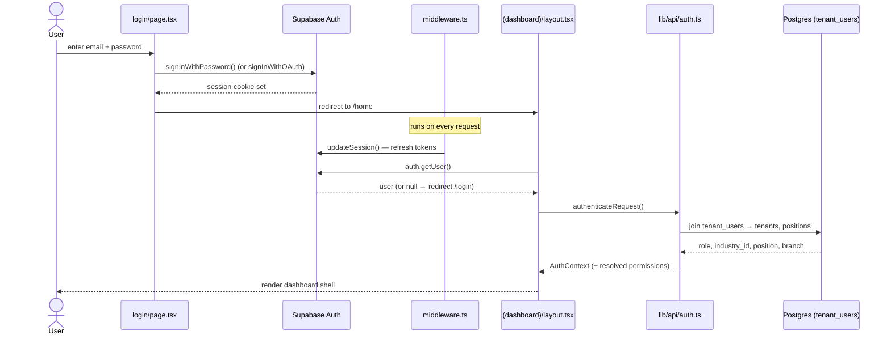
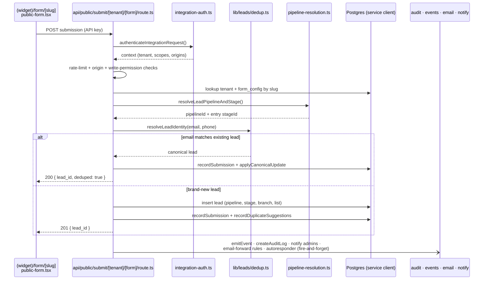

# User Flows

Three representative end-to-end flows, traced through the real code (UI → route → service → data).

## A. Auth / login

Email+password or OAuth via Supabase. The middleware refreshes the session on every request; the dashboard layout re-checks the user and resolves the tenant + permissions before rendering.



## B. Public lead capture (embedded form → lead)

A form embedded on a 3rd-party site POSTs to the public submit endpoint. The endpoint authenticates by API key, rate-limits, enforces per-key origin/permission, resolves the pipeline + entry stage, **dedups by email/phone**, then either updates the canonical lead or inserts a new one — firing audit, events, notifications, and autoresponder as non-blocking side effects.



## C. Deal → Proposal → Project handoff (IT-agency)

Converting a won deal seeds a project from the deal's latest **accepted** proposal (brief, baseline hours→minutes, budget), binds the proposal to the new project, copies deal contacts, and logs a project event. Guards against double-conversion (409). Never blocks: a deal with no accepted proposal converts with a blank baseline.

```mermaid
sequenceDiagram
    actor Admin
    participant Deals as deals/[id]/page.tsx
    participant API as deals/[id]/convert-to-project/route.ts
    participant Auth as authenticateRequest + requireAdmin
    participant DB as Postgres (scoped client)
    participant Events as lib/projects/events.ts

    Admin->>Deals: click "Convert to project"
    Deals->>API: POST convert-to-project
    API->>Auth: auth + feature gate (DEALS, ACCOUNTS) + admin
    Auth-->>API: ok
    API->>DB: load deal; check existing project by deal_id
    alt already converted
        DB-->>API: existing project
        API-->>Deals: 409 ALREADY_CONVERTED { project_id }
    else convert
        API->>DB: findProposalSeed() — latest accepted proposal + line items
        DB-->>API: brief, baseline minutes, budget, rate
        API->>DB: insert project (seeded baseline, deal_id)
        API->>DB: bind proposal.project_id; copy deal_contacts → project_contacts
        API->>Events: recordProjectEvent(baseline_seeded_from_proposal)
        API-)DB: createAuditLog + emitEvent(project.created)
        API-->>Deals: 201 { project }
    end
```

## Anchors
- Login: `src/app/(main)/(auth)/login/page.tsx`, `src/lib/supabase/middleware.ts`, `src/app/(main)/(dashboard)/layout.tsx`, `src/lib/api/auth.ts`
- Lead capture: `src/app/api/public/submit/[tenantSlug]/[formSlug]/route.ts`, `src/lib/leads/{dedup,pipeline-resolution,branch-membership}.ts`, `src/lib/api/integration-auth.ts`
- Deal→Project: `src/app/(main)/api/v1/deals/[id]/convert-to-project/route.ts`, `src/lib/projects/events.ts`
