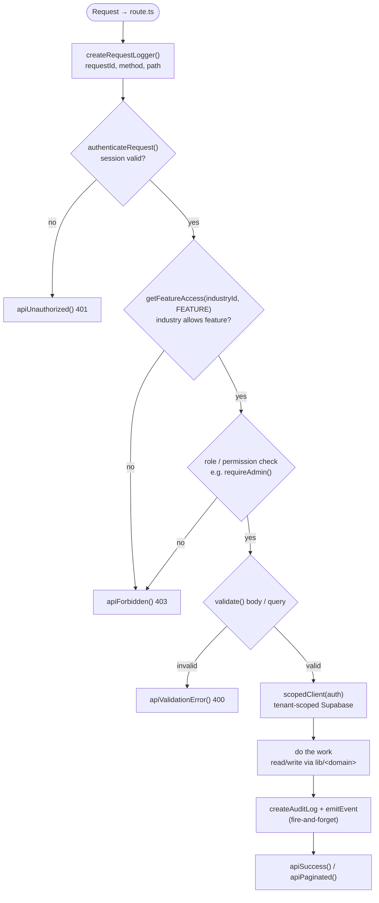
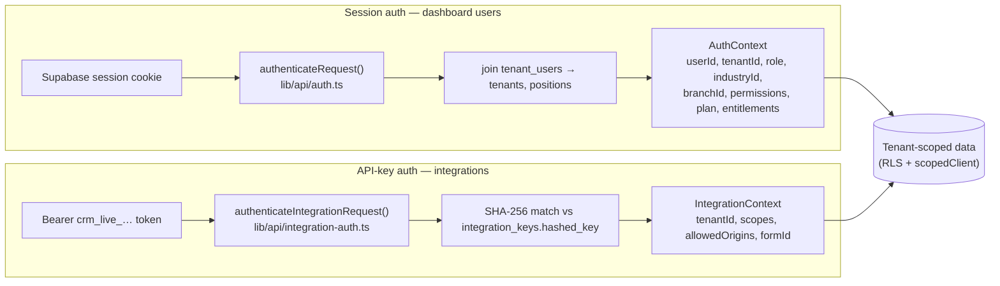
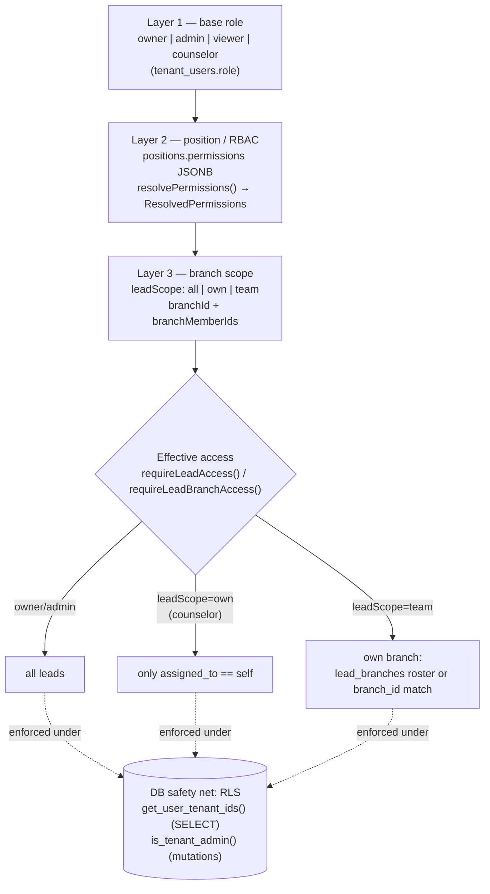

# App Logic

The cross-cutting rules every request obeys: the standard API route pattern, the two authentication systems, and the three-layer permission model.

## API route pattern

Almost every authenticated endpoint under `src/app/(main)/api/v1/` follows the same shape. The `scopedClient` auto-injects `.eq("tenant_id", ...)` so tenant data can't leak.

## Two authentication systems

EdgeX authenticates humans and machines differently, but both resolve to a tenant-scoped context.

## Three-layer permission model

Access is resolved from base role, then narrowed by position/RBAC permissions, then by branch scope. Owners/admins always get full access; a counselor is auto-scoped to their own leads.

## Anchors
- Route pattern: `src/app/(main)/api/v1/leads/route.ts` (canonical), `CLAUDE.md` §API Route Pattern
- Shared API lib: `src/lib/api/{auth,permissions,entitlements,response,validation,rate-limit,audit,integration-auth}.ts`
- Tenant scoping: `src/lib/supabase/{scoped,server,middleware}.ts`
- RLS functions: `supabase/migrations/` (`get_user_tenant_ids`, `is_tenant_admin`); `CLAUDE.md` §Database / RLS Architecture
