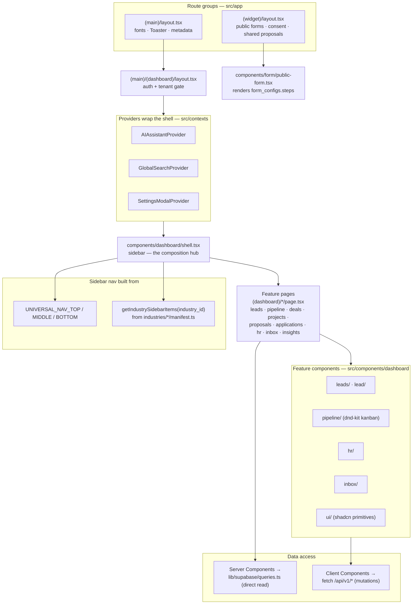
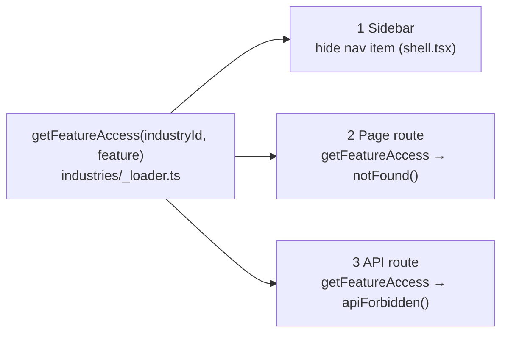

# Component Map

Frontend composition: the layout chain, the industry-driven sidebar shell, feature pages, and the React-Context state layer. There is no Redux/Zustand — Server Components fetch directly via `lib/supabase/queries.ts`, and client components call `/api/v1/*`.

## The industry feature-gate (one truth, three enforcement points)

`getFeatureAccess()` is the single source of truth; it's checked in three places so a disabled feature disappears from the UI *and* is unreachable by URL or API.

## Anchors
- Layout chain: `src/app/(main)/layout.tsx`, `src/app/(main)/(dashboard)/layout.tsx`
- Shell / sidebar: `src/components/dashboard/shell.tsx`
- State: `src/contexts/{ai-assistant,global-search,settings-modal}-context.tsx`
- Data: `src/lib/supabase/queries.ts`; feature components under `src/components/dashboard/*`, primitives in `src/components/ui/`
- Feature gate: `src/industries/_loader.ts`, `src/industries/_registry.ts`
- Public form: `src/components/form/public-form.tsx`
