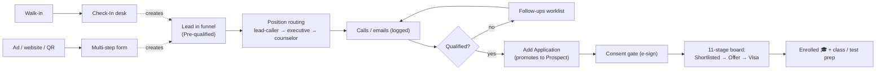
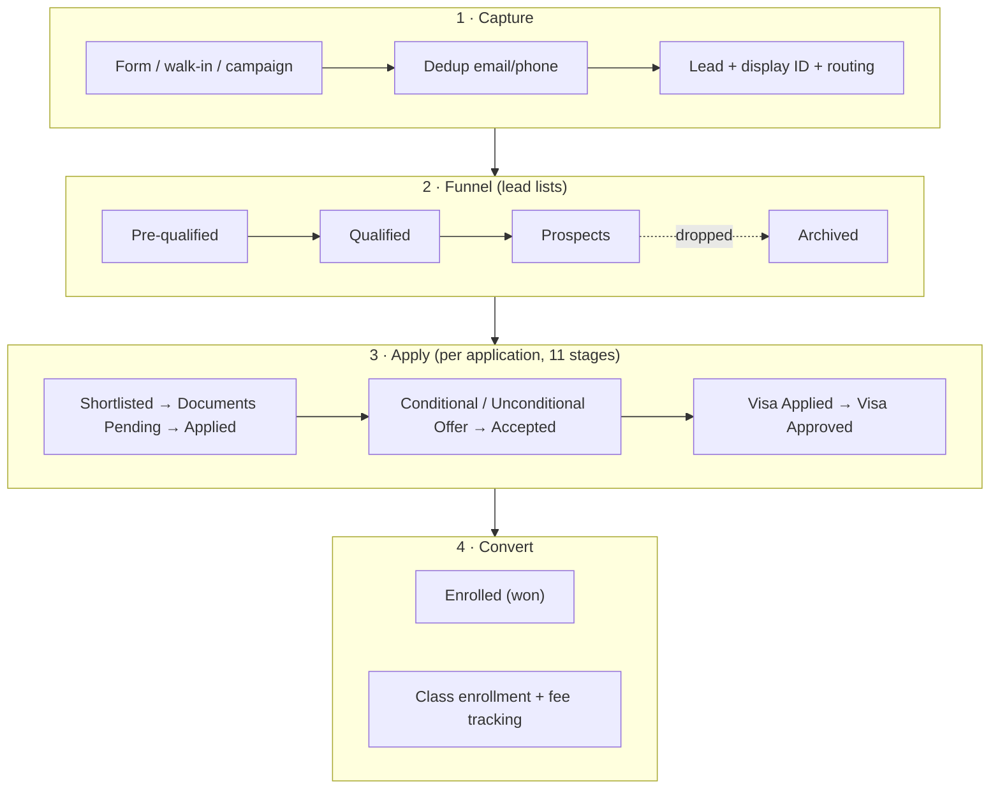
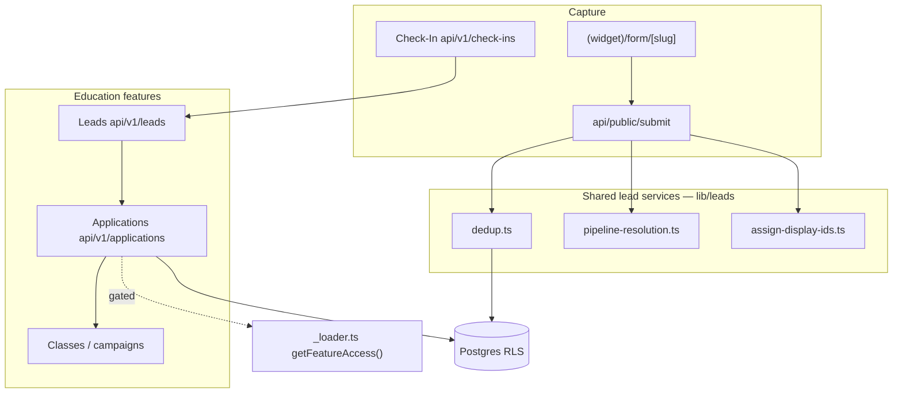
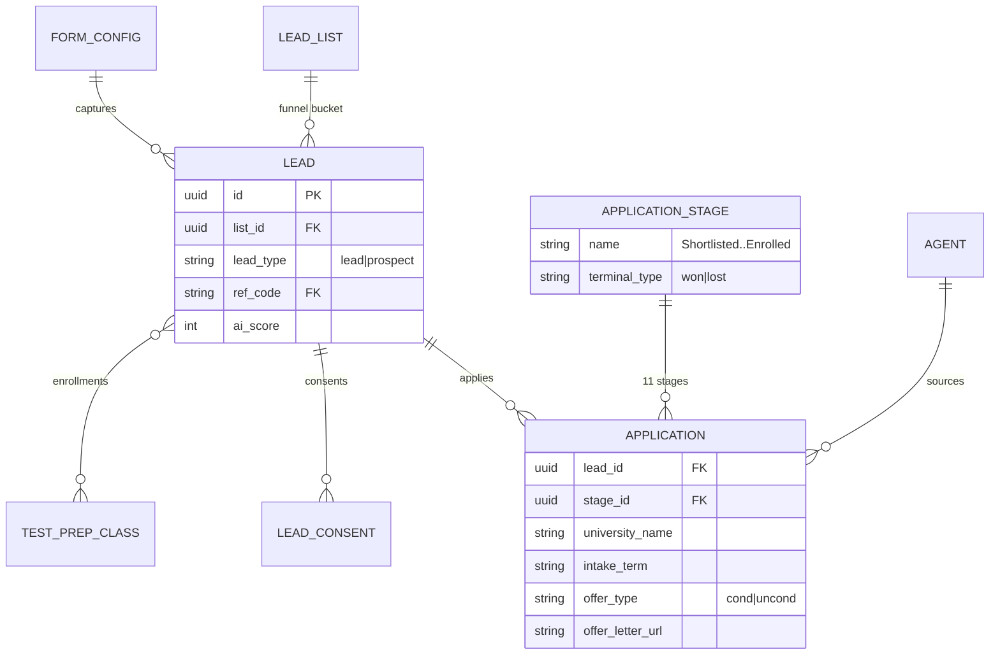

# Domain — Education Consultancy

A dual-audience map of the **education-consultancy** industry — how a study-abroad / admissions consultancy uses EdgeX. Live tenant: **Admizz Education**. Two lenses:

- **Business Logic** — plain language for PMs, product, QC, and clients.
- **Engineering Logic** — system design, DB schema, and component/logic relations for devs.

Every feature is gated by `getFeatureAccess(industryId, featureId)` (`src/industries/_loader.ts`) — enforced in three places: sidebar, page shell (`notFound()`), and API route (`apiForbidden()`). Feature list: `src/industries/education-consultancy/manifest.ts`.

---

## Business Logic

### Feature map (plain language)

| Feature | What it does | Who uses it |
|---------|--------------|-------------|
| **Forms / Form Builder** | Visual multi-step capture forms — templates, autoresponder, UTM links, per-form routing | Marketing, admin |
| **Leads** | Every prospective student — contact, source, status, funnel position | Counselor, telecaller |
| **Lead Lists (funnel)** | Funnel buckets: Pre-qualified → Qualified → Prospects → Archived | Counselor, manager |
| **Application Tracking** | One student → many university applications, each on an 11-stage pipeline | Counselor, app. executive |
| **Consent gate** | e-sign / upload student consent before processing an application | App. executive, admin |
| **Classes & Enrollments** | Test-prep catalog (IELTS/PTE) + per-student fee-paid tracking | Academic team |
| **Campaigns** | Prediction-contest leaderboard to harvest & rank leads (auto-scored) | Owner/admin, telecaller |
| **Follow-ups** | A worklist so a lead handed to a peer never gets dropped | Counselor, executive |
| **Affiliates & Agents** | Referral partners (`ref_code`) and sub-agents who source students | Admin, owner |
| **Countries / Courses** | Reference data: destinations, fields of study, partner colleges | Admin |
| **Check-In** | Front-desk walk-in logging → routes into the funnel | Front desk (lead exec) |
| **Email / Inbox** | Send/receive Gmail against a lead, threaded, multi-inbox | Counselor |
| **Insights / Dashboards** | Build-your-own analytics: widgets by status/source/counselor/UTM | Owner, admin, manager |

### Student journey (UX flow)

### Admissions workflow

### 🤖 AI & automation opportunities

Today the seams exist but **AI is not yet wired**: lead scoring is rule-based (`src/lib/ai/scoring-engine.ts`), the industry AI config (`education-consultancy/ai/agent.ts`) is an empty stub, and Orca / Knowledge-Base embeddings are future-ready hooks (pgvector not built). Highest-value insertions:

- **Lead scoring** — replace the rule engine with an ML/LLM model; the `LeadInsights` contract already exists.
- **Autoresponders** — `form-autoresponder.ts` does merge-tags today; swap for AI-personalized replies per destination/program.
- **Application nudges** — auto-detect missing documents / deadlines (reminders cron exists) and message the student.
- **Status updates** — AI drafts "your application moved to X" from the 11-stage board.
- **Smart routing** — `new-leads-triage/position-routing.ts` + `lead-assignment-chain.ts` are deterministic maps ripe for AI assignment.
- **Orca assistant** — answer counselor/student questions from the Knowledge Base.

---

## Engineering Logic

### System design

### DB schema (education slice)

## Anchors
- Manifest & gating: `src/industries/education-consultancy/manifest.ts`, `src/industries/_loader.ts`
- Application tracking: `src/industries/education-consultancy/features/application-tracking/`, `api/v1/applications/*`, migs `057`/`064`/`066`/`089`
- Funnel & routing: `src/components/pipeline/ListFunnelBoard.tsx`, `features/new-leads-triage/position-routing.ts`, `lead-assignment-chain.ts`, mig `059`
- Leads services: `src/lib/leads/*`; scoring `src/lib/ai/scoring-engine.ts`
- Business docs: `docs/FEATURE-CATALOG.md`, `docs/APPLICATION-TRACKING-BRIEF.md`, `docs/CAMPAIGNS-BRIEF.md`
