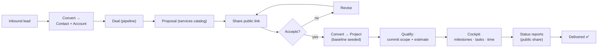
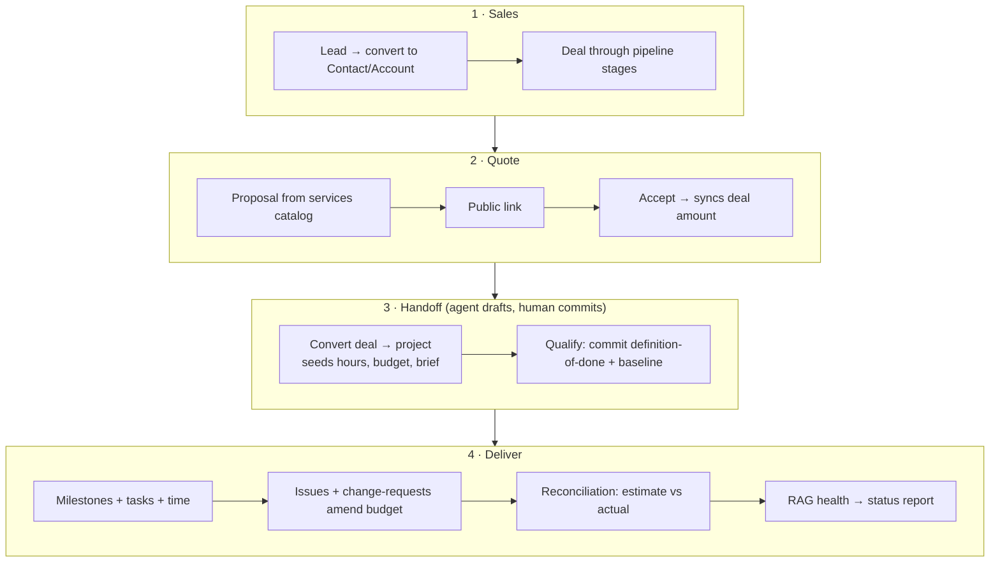
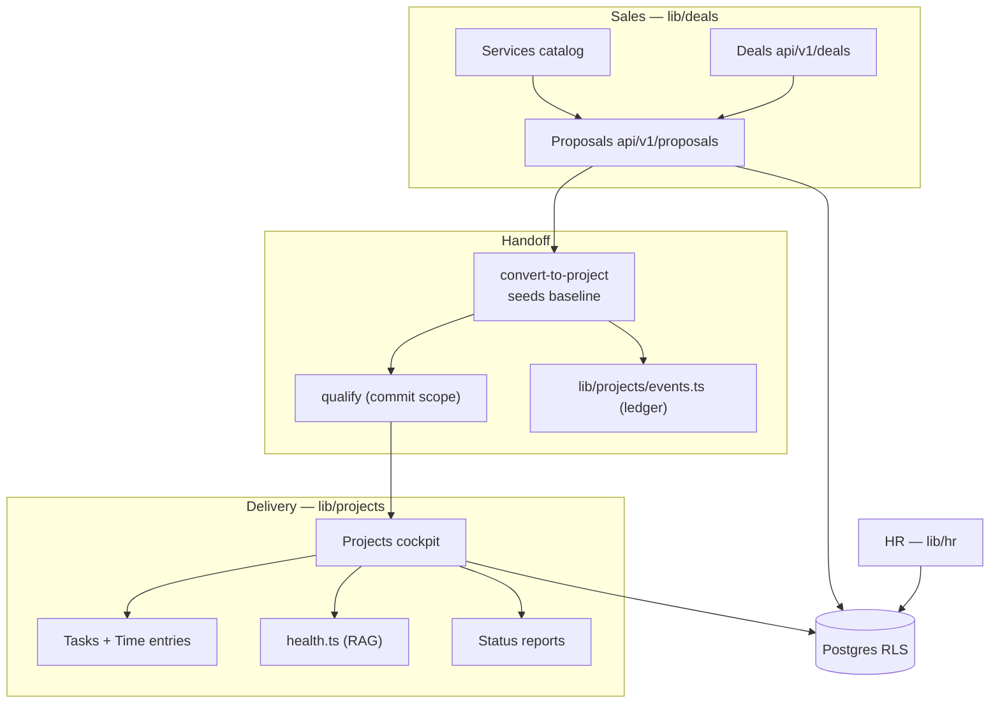
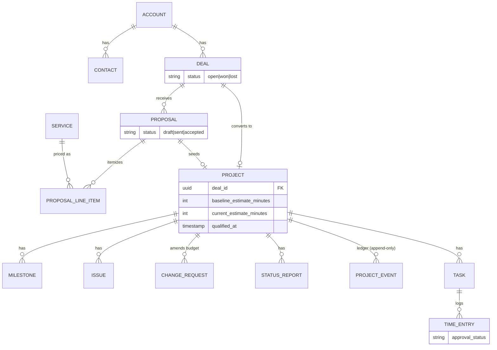

# Domain — IT Agency (Zunkiree Labs)

A dual-audience map of the **it-agency** industry, modeled on the **Zunkiree Labs** tenant: an estimate-to-delivery spine for a software agency. Two lenses:

- **Business Logic** — plain language for sales, PMs, delivery leads, finance, HR, and clients.
- **Engineering Logic** — system design, DB schema, and component/logic relations for devs.

Gated by `getFeatureAccess()` (`src/industries/_loader.ts`). Feature list: `src/industries/it-agency/manifest.ts`. Note: **Insights is education-only** (it-agency gets a 404); HR/People is a universal layer dogfooded on this tenant.

---

## Business Logic

### Feature map (plain language)

| Feature | What it does | Who uses it |
|---------|--------------|-------------|
| **Leads** | Universal inbound prospects before they convert | Sales |
| **CRM Contacts** | People at client companies (leads convert into contacts) | Sales, PM |
| **Accounts** | Client companies — a 360° workspace (projects, team, billable, health) | Sales, delivery |
| **Deals** | Sales opportunities on a multi-pipeline kanban; won/lost from stage | Sales |
| **Services** | Reusable priced service/package catalog feeding proposals | Sales, finance |
| **Proposals** | Priced SOW anchored to a deal; accept syncs deal amount; public share link | Sales, founder |
| **Convert + Qualify** | Accepted proposal seeds the project baseline; human commits scope | Delivery lead, PM |
| **Projects (cockpit)** | Delivery cockpit: milestones, issues, change-requests, RAG health | PM, delivery lead |
| **Tasks + Time + Approvals** | Assignable work, logged hours, approval with rate snapshot | Team, PM, finance |
| **Resourcing / Utilization** | Allocate people to projects; billable hours ÷ capacity | Delivery lead, COO |
| **Status Reports** | Structured client report (accomplishments/risks/asks) + public share | PM → client |
| **People / Leave / Attendance** | HR layer: directory, skills, leave balances, clock in/out | HR, everyone |

### Agency journey (UX flow)

### Sales-to-delivery workflow

### 🤖 AI & automation opportunities

Important: **no real LLM is wired yet** — the AI config (`it-agency/ai/agent.ts`) is an empty stub, Orca and AI-chat are mocks, and the project "pulse" card (`cockpit/ai-summary-card.tsx`) renders hardcoded sample text. But the workflow deliberately captures **clean structured signal** — an append-only decision ledger (`project_events`) — so AI can read it later. Highest-value insertions:

- **Proposal drafting** — generate line items + scope from the deal context and services catalog.
- **Baseline / qualify assist** — the accepted-proposal seed already computes hours/budget in `convert-to-project`; AI drafts, human commits.
- **Project health / risk** — reads `project_events` + reconciliation; `computeProjectHealth` is deterministic today.
- **Status-report generation** — draft the 5 sections from events since the last report (the sample UI already renders them).
- **Timesheet nudges** — flag gaps vs allocations (reminders cron exists).
- **Resource allocation** — match `skills` + capacity to fill the bench.

---

## Engineering Logic

### System design

### DB schema (it-agency slice)

## Anchors
- Manifest & gating: `src/industries/it-agency/manifest.ts`, `src/industries/_loader.ts`
- Handoff & qualify: `api/v1/deals/[id]/convert-to-project/route.ts`, `api/v1/projects/[id]/qualify/route.ts`
- Delivery: `src/industries/it-agency/features/project-board/`, `src/lib/projects/{health,events}.ts`, mig `128_delivery_workflow.sql`
- Sales: `src/lib/deals/{queries,stages}.ts`, `features/{deals,proposals,services}/`
- HR: `src/components/dashboard/hr/*`, `src/lib/hr/*`, migs `112`–`122`
- AI seams (scaffolding): `it-agency/ai/agent.ts`, `features/project-board/lib/ai-preview.ts`, `cockpit/ai-summary-card.tsx`
- Business docs: `docs/FEATURE-CATALOG.md`, `docs/IT-AGENCY-DELIVERY-*.md`, `docs/HRMS-PHASE-*.md`
