# 03 — Developer Workflow & Deployment SOP

**This is the single source of truth for how code and database changes move from a laptop to production. Every developer — and every Claude/AI session working on this repo — MUST follow it. Most "my feature got reverted on prod" and "prod is throwing 500s" incidents trace back to breaking one rule below.**

> Read this alongside `CLAUDE.md` (§ CI/CD & Branching, § Database, § Tenant Isolation) and `docs/reference/01-ARCHITECTURE-INDUSTRY-MODULES.md`.

---

## 0. The 11 non-negotiable rules (TL;DR)

1. **Never commit or merge directly to `main`.** Flow is always `feature/* → stage → main`. `main` = production, auto-deploys on every push.
2. **Never merge directly to `stage` either — open a PR, and a lead must approve it.** PRs run CI (lint/type/build/test) and leave a review trail. **Every** feature PR into `stage` needs **1 approval from a lead** (`@sthasadin` / `@ani-shh`) before it merges — no self-merging (see § 10).
3. **Always branch from the latest `origin/stage`, and rebase onto it right before you merge.** Stale bases are the #1 cause of a merge silently reverting someone else's work on a shared file.
4. **One migration number = one file, globally unique.** Check the highest number in `supabase/migrations/` and take the next one. Never reuse a number.
5. **Migrations are DB-first and environment-explicit.** Apply to **stage** → verify → (at promotion) apply to **prod**. There are **two separate databases**; a migration on one is *not* on the other.
6. **Migrations apply automatically in the deploy, gated on prod.** A stage→main promotion carrying migration file(s) **pauses for a required-reviewer approval** (`production-db` environment), applies them to the prod DB **before** the container swaps, then deploys — so new code never runs on an old schema (split-brain is structurally prevented, no longer a manual apply-before-merge you can forget). Code-only promotions skip it. Review the migration in the PR; approve it in the deploy. (Emergency out-of-band prod SQL can still be hand-applied under per-action approval.)
7. **Migrations are additive + reversible.** Wrap in a transaction, log before/after row counts, include a rollback line. No destructive `DROP TABLE` / `DROP COLUMN` on live data without an explicit, approved plan.
8. **Never resolve a conflict on a hot shared file by "keep my whole file."** Merge hunk-by-hunk. Assume the other person also changed `shell.tsx`, `leads/route.ts`, `queries.ts`, etc.
9. **Rollback is a fire alarm, not a convenience.** `rollback.yml` un-deploys everything after the target SHA and does **not** roll back the database. Announce before running it (see § Rollback).
10. **Prod DB changes require explicit, per-action approval from Sadin.** State the exact SQL + expected before/after counts; run only after "go" for that specific change. Never batch.
11. **Local first.** Build and verify on your **isolated local DB** (OrbStack Supabase) before pushing — including testing a new migration on the local baseline. Local is a real environment now, not a window onto the shared stage DB. See `LOCAL-DEV-SETUP.md`.

If you're an AI session: you may apply migrations to **stage** and verify. You may **not** touch **prod** (DB or deploy) without an explicit per-action "go." You do not merge PRs unless told.

---

## ⚡ What changed — this is now ENFORCED, not just asked (2026-07-06)

**`main` and `stage` are branch-protected on GitHub.** The rules above used to rely on everyone remembering them; now GitHub blocks the dangerous actions. This is why work stops "reverting." **Read this — your day-to-day changed:**

- **You can't push to `stage` or `main` directly anymore.** Everything is a Pull Request. `git push origin stage` / `git push origin main` will be **rejected**.
- **Your PR must be up to date with its base before it can merge.** If someone merged to `stage` after you branched, GitHub shows **"This branch is out-of-date"** — click **"Update branch"** (or `git fetch && git rebase origin/stage && git push --force-with-lease`) before merging. *This is the single rule that stops your PR from silently reverting a teammate's work.*
- **CI must be green** (Lint, Type Check, Build). Red PRs can't merge. (Vercel check is noise — ignore it.)
- **Feature PRs into `stage` merge by SQUASH** (one clean commit per feature). The merge button says **"Squash and merge."**
- **You can't force-push or delete `stage`/`main`.** History is safe.
- **CODEOWNERS auto-requests reviewers** (@sthasadin / @ani-shh) when you touch hot shared files (`shell.tsx`, `queries.ts`, leads routes, manifests, migrations, CI). Wait for / ping them.
- **Both `stage` and `main` require a lead reviewer's approval before merge** (Zunkiree Labs policy — updated 2026-07-08). `stage` = **1 approval from a lead** (`@sthasadin` / `@ani-shh`) on **every** feature PR; `main` = 1 approval on the promotion. You no longer self-merge to stage — a lead checks and accepts it. Full role-by-role flow in **§ 10**. *(Enforce in Settings → Branches: `stage` required approvals = 1.)*
- Rules apply to admins too — nobody bypasses. In a genuine emergency an admin can toggle protection off in repo Settings → Branches, then restore it.

**For your Claude/AI session:** same rules. It branches from the latest `origin/stage`, opens a PR to `stage`, waits for green CI, squash-merges; it never pushes to `stage`/`main` directly, never merges to `main` without a stage→main PR + approval, and never touches prod without an explicit per-action "go." If your Claude proposes `git push origin stage/main`, a merge-commit into stage, or skipping "Update branch," it's wrong — stop it.

### ⚡ Two more CI guards added (2026-07-07) — after the "#140 promotion" incident

A real promotion nearly broke because of two latent problems; both are now caught by CI so they can't recur silently. Read the one-paragraph post-mortem so you understand *why*:

> Promoting #140 surfaced that migrations **124/126/127 had been hand-applied to both DBs but shipped without their self-record line** — so the ledger sat at 123 while the schema was at 127. The auto-migrate runner then saw all three as "pending" and would have re-run them; **124's unguarded `CREATE POLICY` fails on re-run → fail-closed → blocked deploy.** Separately, a feature (#138) had been merged **straight to `main`**, diverging main from stage, so a blind `stage→main` promotion hit conflicts. Both were reconciled by hand; these two guards stop the class of bug.

- **Migration Guard** (`scripts/check-migrations.sh`, runs on every PR): every migration file numbered **≥ 123** that your PR adds/edits **must** contain its self-record `INSERT INTO public.schema_migrations (version) VALUES ('<its exact filename>') ON CONFLICT (version) DO NOTHING;`. Missing it fails the PR. Run it locally: `BASE_REF=origin/stage scripts/check-migrations.sh` (or `--all` to audit the whole tree).
- **Promotion Source Guard** (runs on every PR): a PR **into `main`** may only come from **`stage`** or a **`promote/*`** branch. This blocks the direct-to-main feature merge that diverged the branches. Feature work goes to stage first — always.
- **Never hand-apply a migration to prod out-of-band as the normal path.** The `production-db` gate in the deploy *is* the apply mechanism now. Out-of-band `psql`/MCP application is for genuine emergencies only, and if you do it you **must** run the migration's own self-record `INSERT` in the same session (or the ledger drifts — that's exactly what caused the incident above).

---

## 1. Why this doc exists (the failure modes it prevents)

| Symptom | Root cause | Rule that prevents it |
|---|---|---|
| "A feature that was live on prod disappeared." | A branch built off a **stale base** merged and clobbered a shared file; or a conflict was resolved "keep my side." | 3, 8 |
| "Prod is 500ing right after a deploy." | Code merged to `main` (auto-deploys) but the **migration wasn't applied to the prod DB**. | 5, 6 |
| "We applied migration N but it's not there." | **Duplicate migration number** or no record of what's applied where — no ledger. | 4, § Migrations |
| "Rollback took prod down / brought back an old bug / broke the schema." | `rollback.yml` uses the wrong compose file, rebuilds on the slow box, detaches HEAD, and never rolls back the DB. | 9, § Rollback |
| "Stage and prod behave differently." | A migration or a `.env`/compose pointer was changed in only one environment. | 5, § Environments |
| "The next deploy's migrate step failed / a migration keeps re-running." | A migration shipped **without its self-record line** (or was hand-applied without recording) → ledger drift → runner re-runs it → a non-idempotent statement (e.g. unguarded `CREATE POLICY`) errors, fail-closed. | Migration Guard CI, § Migrations |
| "Promoting stage→main hit conflicts / main had a feature stage never saw." | A feature was merged **straight to `main`**, diverging the branches. | Promotion Source Guard CI, rule 1 |

---

## 2. Environments (know which one you're touching)

| Env | Branch | URL | Supabase project | Deploy trigger |
|---|---|---|---|---|
| **Local** | your `feature/*` | `localhost:3000` | **local** — Supabase on OrbStack, isolated (`127.0.0.1:54321`) | `npm run dev` |
| **Staging** | `stage` | `dev-lead-crm.zunkireelabs.com` | **stage** DB (`dymeudcddasqpomfpjvt`) | push to `stage` |
| **Production** | `main` | `edgex.zunkireelabs.com` / `lead-crm.zunkireelabs.com` | **prod** DB (`pirhnklvtjjpuvbvibxf`) | push to `main` |

- **Three tiers, three databases.** As of **2026-07-08**, local dev runs its **own isolated Supabase** (OrbStack Docker) instead of pointing at the shared stage DB. So "works locally" now means real isolation — you can wipe, reseed, and break your DB with zero effect on anyone else. Setup + daily use is **[`LOCAL-DEV-SETUP.md`](./LOCAL-DEV-SETUP.md)** — every new dev runs it once.
- **Local login:** `admin@edgex.local` / `edgexdev123` (tenant *Test Agency*, `it_agency`). **Flip the app back to the stage DB** anytime with `cp .env.stage.local .env.local` (your stage env is backed up there; both are gitignored).
- **Two separate *hosted* Supabase databases since 2026-06-21** (stage + prod). They do **not** share data or schema. "Applied a migration" is meaningless without saying *which DB* — and note local is now a third.
- The hosted DB pointer lives in **two places per environment** — `docker-compose*.yml` build args (baked at build) **and** the VPS `.env.local` (runtime). Change both in lockstep or you get a client/server split-brain.

---

## 3. Branch & PR lifecycle (the happy path)

```
git fetch origin
git switch -c feature/<short-name> origin/stage       # 1. branch from LATEST stage
scripts/migrate-apply.sh local                        # 1b. sync local DB — apply any migration files that came with the pull
# ... build against your isolated local DB (npm run dev). Commit in logical chunks. ...
git fetch origin && git rebase origin/stage            # 2. rebase before you open/refresh the PR
scripts/migrate-apply.sh local                         # 2b. re-sync local DB after the rebase pulls new migrations
npm run build && npx eslint --max-warnings 50          # 3. gates green locally
gh pr create --base stage --title "..." --body "..."   # 4. PR ALWAYS targets stage
# 5. CI green (Build / Lint / Type Check). Vercel check is noise — ignore it.
# 6. If GitHub says "out-of-date", click "Update branch" (or rebase again). REQUIRED to merge.
gh pr merge <n> --squash --delete-branch               # 7. Squash-merge to stage → deploys to dev-lead-crm. Smoke it.
```

**Rules of the path:**
- **Step 1, 2 & 6 are the ones people skip and regret.** If your branch is a day old, someone has touched `stage`. Rebase / Update branch — GitHub now *requires* it before merge.
- **You can't push to `stage` directly** — the PR is the only way in. Base must be `stage`, never `main`.
- **Feature PRs merge by SQUASH** (one commit per feature). `--delete-branch` keeps the branch list clean so nothing gets re-merged by accident.
- **Keep PRs small and single-purpose.** A 1-file PR rarely conflicts; a 30-file PR touching `shell.tsx` will.

---

## 4. Shared-file conflict discipline

A short list of files are edited by almost every feature. When git flags a conflict here, **never** take "my whole file."

- `src/components/dashboard/shell.tsx` (sidebar/nav — Server→Client boundary)
- `src/lib/leads/queries.ts` (getLeads and scoping — has had **prod hotfixes** that MUST survive)
- `src/app/(main)/api/v1/leads/route.ts`
- `src/app/(main)/api/v1/lead-lists/route.ts`
- `src/industries/*/manifest.ts`, `src/industries/_registry.ts`
- `src/lib/settings/catalogs.ts`

**Protocol:** resolve hunk-by-hunk; keep *both* sides' intent. After resolving, `git log -5 <file>` on `origin/main` to confirm no prod hotfix was dropped. When in doubt, ask the file's other recent author (see `git log --format='%an' -- <file>`).

---

## 5. Migration protocol (the part that causes 500s)

Migrations are **plain SQL files in `supabase/migrations/`**. Both stage and prod now **apply them automatically inside the deploy pipeline** via a ledger-diff runner (`scripts/migrate-apply.sh`): **staging** applies on every deploy; **prod** applies behind a **required-reviewer approval gate** (the `production-db` GitHub Environment), *before* the container swaps — so the split-brain is structurally impossible, not just discouraged (see "Applying" below). A **ledger table** (`public.schema_migrations`, mig 123) records what's applied to each DB; each migration **self-records its own filename**. You can still apply by hand (psql / Supabase MCP) for out-of-band or emergency changes — the runner then sees it already in the ledger and no-ops. Treat every migration as a coupled release with its code. Start from **`supabase/migrations/_TEMPLATE.sql`**.

### Authoring
- **Number:** `ls supabase/migrations/ | sort` → take `<highest + 1>`. **Never reuse a number** (historical dupes `110_*`/`112_*` exist from before this rule — don't add more).
- **Shape:** wrap in `BEGIN; … COMMIT;`. **Additive only** (add tables/columns/policies). Include a header comment with: what it does, expected **before/after row counts**, and a **rollback** line.
- **Self-record in the ledger (required — CI-enforced).** End every migration, inside the transaction, with:
  ```sql
  INSERT INTO public.schema_migrations (version) VALUES ('NNN_name.sql')
    ON CONFLICT (version) DO NOTHING;
  ```
  Set the string to the file's exact name. This is how the ledger stays true no matter who applies it or with which tool. **The Migration Guard CI check fails your PR if it's missing** (see the 2026-07-07 post-mortem above) — this is not optional.
- **Every statement must be idempotent (safe to re-run).** The auto-migrate runner can re-encounter a migration; a non-idempotent statement then errors and, fail-closed, blocks the deploy. Use `CREATE TABLE/INDEX IF NOT EXISTS`, `ADD COLUMN IF NOT EXISTS`, `INSERT … ON CONFLICT DO NOTHING`, guarded `UPDATE`s, and — because policies have no `IF NOT EXISTS` — `DROP POLICY IF EXISTS "p" ON t; CREATE POLICY "p" …`. (Mig 124's unguarded `CREATE POLICY` was the concrete bug.)
- **New tenant-owned table?** `tenant_id UUID REFERENCES tenants(id) ON DELETE CASCADE` + RLS policies (`get_user_tenant_ids()` for SELECT, `is_tenant_admin(tenant_id)` for mutations). See `CLAUDE.md` § Tenant Isolation.
- **Editing a SHARED object** (a view, a `SECURITY DEFINER` function, an RLS policy on an existing table) is the DB equivalent of a shared-file conflict — two devs `CREATE OR REPLACE`-ing the same function out of order silently reverts one. Flag it, coordinate, and note it in the PR.
- **One-time data ETL does NOT belong in a numbered migration.** A migration file is *schema* — DDL that must replay cleanly on **any** database, including an empty one. A one-time data load/backfill/reconciliation tied to a specific tenant's real rows (hardcoded UUIDs, `RAISE EXCEPTION 'Expected N rows'` assertions, prod-only FKs) is **not** schema — put it in **`scripts/`** and run it once against the named DB. Mixing the two is what made migrations `009` + the Admizz/RKU/Agentics series (`069`–`096`) **unreplayable from scratch** (they abort on an empty DB), which is why local now baselines its schema from stage instead of replaying history (`LOCAL-DEV-SETUP.md` § "why baseline"). If a schema change genuinely needs a data step, make the data step idempotent and guarded (`WHERE EXISTS (…)`) so it no-ops on a DB that doesn't have the rows — never assert on counts that only hold on prod.

### Applying — order matters
1. **Local first.** Apply the new migration to your **local baseline DB** and verify the feature + RLS as a real logged-in user. Isolated and free — catch the obvious errors before a shared DB ever sees them. (Local doesn't replay history, so you apply just your new file on top of the baseline — see `LOCAL-DEV-SETUP.md` § "testing a new migration".)
2. **Stage next.** Apply to the stage DB (`dymeudcddasqpomfpjvt`), in a transaction, log before/after counts. Verify tables/policies/seed. Smoke on dev as a **real logged-in user** (not service-role — RLS only shows up under a real JWT).
3. **Prod — automatic + gated at promotion (no more manual apply-before-merge).** When a stage→main promotion contains migration file(s), the prod deploy (`deploy.yml`) detects them (`migrate-check` job), **pauses at "Apply Pending Migrations" for a required-reviewer approval** (`production-db` environment — reviewers sthasadin/ani-shh, admin-bypass off), applies them to the prod DB **before** the container swaps, then deploys. Migrations always land before the code that needs them → the "new code on old schema = 500s" split-brain can't happen. A code-only promotion skips the migrate job entirely (no approval pause). **So for the normal flow you no longer hand-apply to prod before merging** — you review the migration in the PR, then approve it in the deploy. (Emergency/out-of-band prod SQL can still be applied by hand under per-action approval; the runner then no-ops on it.)
4. **Check the ledger — don't guess.** `STAGE_DB_URL=… scripts/migrate-status.sh stage` (or `prod`) lists **applied vs pending vs ghost** for that DB. A migration is **not on prod until it shows applied on prod.** Because it self-records, applying it *is* recording it — no separate bookkeeping.

### The ledger (`public.schema_migrations`, mig 123 — adopted)
Each DB has a `schema_migrations(version TEXT PRIMARY KEY, applied_at, applied_by)` table; every migration self-records its filename (keyed on filename, so the historical `110`/`112` dupes are distinct rows). "What's applied on `<env>`?" is now `scripts/migrate-status.sh <env>` — not a guess. This closes the duplicate-number and split-brain classes.

**Backfill note (per-DB, deliberate):** stage was backfilled with all present files when the ledger landed. **Prod is backfilled at the consolidated promotion, AFTER the held migrations are applied** — a blind insert-all on prod would wrongly mark held migs as applied. At promotion: apply mig 123 to prod → apply each held migration (they self-record) → backfill the remaining historical prod set → `migrate-status.sh prod` should then show 0 pending. **As of 2026-07-07 both ledgers read `125/125, 0 pending`** (drift from 124/126/127 reconciled; those three now self-record). The Migration Guard keeps them in sync going forward.

---

## 6. Deployment runbook

### 6a. Deploy to staging
Merging a PR to `stage` **is** the staging deploy (`deploy-staging.yml` builds in CI → GHCR, VPS pulls). Then:
- Watch it: `gh run list --limit 5`.
- Smoke `dev-lead-crm.zunkireelabs.com` — the actual feature, plus one tenant-isolation negative.

### 6b. Promote to production
Do this deliberately, not casually. **Sequence (never reorder):**

```
1. Confirm stage is green and smoked. Skim the migrations since the last prod promotion
   (`git diff origin/main..origin/stage -- supabase/migrations/`) and review them in the PR —
   you approve them at step 4, so know what they do (before/after counts, additive, rollback line).
2. Promote code via a PR (you can NOT push to `main` directly — it's protected):
      gh pr create --base main --head stage --title "Promote stage → main (prod deploy)" --body "..."
   Wait for CI green + **1 approval** (from another admin), then merge it (use a **merge commit** —
   main keeps stage's individual commits; do not squash the whole promotion).
3. The push to `main` runs the prod deploy. If the promotion carries migration file(s), it
   **pauses at "Apply Pending Migrations" for a required-reviewer approval** (`production-db`
   environment). Review the pending list in the job log, then approve → it applies to the prod
   DB **before** the container swaps, then deploys. Code-only promotions skip this with no pause.
   Watch `gh run list`.
4. Post-deploy: hit prod, confirm the feature + no 500s. Check `docker logs leads-crm`.
   `scripts/migrate-status.sh prod` should read 0 pending.
5. Update docs/SESSION-LOG.md: what shipped, which migs are now on prod.
```

- **Manual steps the runner can't do** (e.g. creating a private storage bucket, a data backfill outside `supabase/migrations/`, or an out-of-band emergency change): apply those to the prod DB by hand **before** promoting, with per-action approval + before/after counts.
- **`main` is protected**: promotion is always a `stage → main` PR with 1 approval — no `git push origin main`, no `git merge && push`. Merge it as a **merge commit** (not squash) so each feature stays visible on `main`. **The PR into `main` may only come from `stage` or a `promote/*` branch** (Promotion Source Guard enforces this) — never a `feature/*` branch straight to main.
- **If stage has drifted from main** (someone hand-merged to main, or a prior promotion was squashed and lost ancestry), reconcile before promoting: cut a `promote/stage-to-main-<date>` branch from `origin/stage`, `git merge origin/main` into it, resolve conflicts **hunk-by-hunk** keeping stage's superset, build, and open **that** branch → `main`. This restores main as an ancestor so the promotion is conflict-free (the working precedent is the 2026-07-07 #143 promotion).
- Never run a bare `docker compose` in the prod dir — there's a stray dev `docker-compose.yml` there that clobbers prod. The workflows use `-f docker-compose.prod.yml`; you should too if you ever touch the box.

### 6c. Hotfix straight to prod
Only when `stage == main` and it's urgent. Branch from `origin/main`, PR to `main`, and **backport to `stage` immediately** (cherry-pick or merge `main → stage`) so stage doesn't fall behind and re-revert the fix on the next promotion.

---

## 7. Rollback runbook (dangerous — read before using)

`rollback.yml` (`gh workflow run rollback.yml -f commit_sha=<SHA> -f reason="…"`):

- **It reverts CODE only. It does NOT roll back the database.** If the bad deploy included a migration, rolling back code leaves new schema under old code — a *different* split-brain. Decide the DB story first.
- **It un-deploys everything after `<SHA>`.** Every feature merged after that commit vanishes from prod until you roll forward. This is the most common "my feature got reverted!" report — always announce in the team channel before running it.
- **It pins the box to a detached HEAD** (`git checkout <sha>`). The next normal deploy's `git pull origin main` must be reconciled — don't leave prod detached; roll forward to a real `main` commit as soon as the incident is resolved.
- **Prefer roll-*forward*:** a small revert PR through `stage → main` is usually safer and keeps history linear.

> ⚠️ Known defect being fixed: the current `rollback.yml` uses bare `docker compose up -d --build` (wrong compose file + slow on-box rebuild). Until patched, do not rely on it blind — see the open fix.

---

## 8. Team collaboration norms (how a disciplined team keeps this frictionless)

The rules above are mechanical. These are the human habits that make them cheap to follow — this is how strong teams avoid stepping on each other.

- **Small, single-purpose PRs, merged often.** A 1–3 file PR reviewed same-day rarely conflicts. A week-long 30-file branch is a guaranteed shared-file collision and a reversion risk. Slice work down.
- **Keep `stage` green and deployable at all times.** `stage` is shared ground. If you merge something that reddens CI or breaks dev-lead-crm, fixing it is your top priority — everyone branches from `stage`, so a broken `stage` blocks the whole team.
- **Claim shared surfaces out loud.** Before a change that touches a hot shared file (`shell.tsx`, `queries.ts`, the manifests, migrations), say so in the team channel: *"editing shell.tsx sidebar for feature X."* Two people editing it silently is how a merge drops a side. `git log --format='%an' -- <file>` tells you who else has been in there.
- **Announce migrations before you apply them to a shared DB.** Stage is shared; a surprise schema change can break a teammate's local dev. One line in the channel: *"applying mig 121 (adds column Y) to stage now."*
- **Review turnaround < 1 business day.** Stale PRs rot against a moving `stage`. If you can't review deeply, at least unblock (approve-with-nits) so the author can rebase-merge before drift.
- **The author rebases; the reviewer never force-pushes someone else's branch.** Only the branch owner rewrites their history.
- **Ownership of `main` promotions is explicit.** Production promotion (migrations-to-prod + `stage → main`) is done by the release owner (Sadin, or whoever he delegates per release) — not ad-hoc by whoever merged last. One hand on the prod lever at a time.
- **Every dev's AI/Claude session must read this doc + `CLAUDE.md` first.** The AI follows the same rules: branch from latest `stage`, PR to `stage`, migrations stage-first, never touch prod without explicit per-action approval, never self-merge. If your Claude proposes merging to `main` directly or skipping the migration-before-code order, stop it — it's wrong.
- **Write it down when it ships.** Update `docs/SESSION-LOG.md` (what shipped + migs now on prod), `docs/FEATURE-CATALOG.md` (the feature row), and prune the roadmap. The next person (or next AI session) relies on that record being true.

**North star:** anyone — a new hire, a teammate, or a fresh AI session — should be able to open this doc and the PR template and ship safely without tribal knowledge. If something bit us and isn't written here yet, add it.

---

## 9. Checklists (copy into your PR / promotion)

**Before opening a PR:**
- [ ] Branched from and rebased onto **latest `origin/stage`**.
- [ ] Base branch is `stage` (not `main`).
- [ ] `npm run build` clean, `npx eslint --max-warnings 50` clean.
- [ ] New migration? Unique number, transactional, additive, rollback line, before/after counts. Applied to **stage** + verified.
- [ ] Touched a hot shared file? Re-checked I didn't drop a prod hotfix.
- [ ] Tenant isolation preserved (`scopedClient` or explicit `.eq("tenant_id", …)`; new table has RLS).

**Before promoting to prod:**
- [ ] Stage green + smoked.
- [ ] Migrations are on stage + self-record; ledgers clean (`migrate-status.sh`). **The prod DB apply happens automatically at the gate** — a lead approves the `production-db` environment and it applies **before** the swap (§ 5, § 10 Stage 8). No manual pre-apply for the normal flow.
- [ ] Any manual prod steps done (storage buckets, env pointers in lockstep).
- [ ] Lead approves + merges `stage → main` (merge commit), approves the migration gate, watch deploy, smoke prod, confirm no 500s.
- [ ] `docs/SESSION-LOG.md` updated with what shipped + which migs are now on prod.

---

## 10. The complete team workflow — the SOP every change follows

**This is the canonical, end-to-end path for a change at Zunkiree Labs — from a developer's laptop to production, and exactly where a lead checks and accepts the work.** Every change follows it; no shortcuts. It has two roles:

| Role | Who | Owns |
|---|---|---|
| **Developer** | anyone building a change (incl. an AI/Claude session) | local build & test · authoring migrations · opening PRs · merging *after* approval · verifying each deploy |
| **Lead Reviewer** | **`@sthasadin` / `@ani-shh`** | **reviewing & accepting** every feature PR into `stage` · approving the `stage → main` promotion · approving the **prod-DB migration** in the deploy gate |

**Policy (2026-07-08):** a **Lead Reviewer must approve every feature PR into `stage`** — developers do **not** self-merge. This is the team's quality gate; the lead is the second pair of eyes on every change before it reaches the shared staging environment, and the sole approver of everything that reaches prod.

### 10.1 The flow — two views of the same thing

**Plain view** — reads anywhere, including VS Code's Markdown preview (no Mermaid extension needed):

```text
        THE ZUNKIREE LABS DEV WORKFLOW — every change follows this

╭──────────────────────────────────────────────────────────────────╮
│  ① LOCAL — you, on your machine        (every time you start work) │
├──────────────────────────────────────────────────────────────────┤
│  1. Get the latest       git fetch · branch off origin/stage       │
│  2. Sync your database   scripts/migrate-apply.sh local            │
│  3. Start the app        npm run dev                               │
│                                                                    │
│  4. ★ BUILD YOUR FEATURE ★  — write the code / make your changes    │
│         (this is the actual work — the rest is just getting in     │
│          and out of it safely)                                     │
│                                                                    │
│  5. Changed the database?   add a migration file + test on local   │
│  6. Check it works          click through, logged in as a user     │
│  7. Get the latest again    rebase on stage · build + lint pass    │
╰──────────────────────────────────────────────────────────────────╯
              │
              ▼   You open a Pull Request  ──►  stage
╭──────────────────────────────────────────────────────────────────╮
│  ② A LEAD CHECKS YOUR WORK                     🟨 lead approval #1  │
├──────────────────────────────────────────────────────────────────┤
│   Robot checks first:  Lint · Type · Build · Test · Guards         │
│              │                                                     │
│   A lead (@sthasadin / @ani-shh) reads your code + migration       │
│         ├─ needs changes  →  back to step 4                        │
│         └─ APPROVES  →  you merge it                               │
╰──────────────────────────────────────────────────────────────────╯
              │
              ▼   You merge  ──►  stage   (this deploys automatically)
╭──────────────────────────────────────────────────────────────────╮
│  ③ IT GOES LIVE ON STAGING              (automatic — no clicks)     │
├──────────────────────────────────────────────────────────────────┤
│   build the app → update the STAGE database → restart the app      │
│              │                                                     │
│   ● LIVE at dev-lead-crm.zunkireelabs.com  → you test it there     │
╰──────────────────────────────────────────────────────────────────╯
              │
              ▼   Open a Pull Request  stage ──► main   (to go to prod)
╭──────────────────────────────────────────────────────────────────╮
│  ④ A LEAD APPROVES THE RELEASE                 🟨 lead approval #2  │
├──────────────────────────────────────────────────────────────────┤
│   Guards + robot checks pass                                       │
│              │                                                     │
│   A lead reviews the release → APPROVES → merges to main           │
╰──────────────────────────────────────────────────────────────────╯
              │
              ▼
╭──────────────────────────────────────────────────────────────────╮
│  ⑤ IT GOES LIVE IN PRODUCTION           🟨 lead approval #3         │
├──────────────────────────────────────────────────────────────────┤
│   If there's a database change, the deploy PAUSES and waits:       │
│              │                                                     │
│   A lead approves  →  update the PROD database  →  restart app     │
│              │                                                     │
│   ● LIVE at edgex.zunkireelabs.com  → smoke-test · log it          │
╰──────────────────────────────────────────────────────────────────╯

  A lead checks your work at 3 points:  #1 your PR to stage ·
  #2 the release to prod · #3 the production database change.
  Nothing reaches staging or production without a lead's OK.

  Golden rule: the database change always lands BEFORE the code that
  needs it — local (you) · stage (robot) · prod (lead approves).
```

**Visual flowchart** — renders as a diagram on GitHub and in editors with Mermaid support:

```mermaid
flowchart TB
  classDef dev  fill:#e0e7ff,stroke:#4f46e5,color:#1e1b4b;
  classDef work fill:#c7d2fe,stroke:#4338ca,color:#1e1b4b,stroke-width:3px;
  classDef lead fill:#fde68a,stroke:#b45309,color:#442100;
  classDef ci   fill:#ede9fe,stroke:#7c3aed,color:#2e1065;
  classDef db   fill:#cffafe,stroke:#0e7490,color:#083344;
  classDef live fill:#bbf7d0,stroke:#15803d,color:#052e16;

  subgraph PH1["① LOCAL — you, on your machine (every time you start work)"]
    direction TB
    A1["1 · Get the latest<br/>git fetch · branch off origin/stage"]:::dev
    A2["2 · Sync your database<br/>scripts/migrate-apply.sh local"]:::db
    A3["3 · Start the app<br/>npm run dev"]:::dev
    A4["★ 4 · BUILD YOUR FEATURE ★<br/>write the code / make your changes"]:::work
    A5["5 · Changed the DB?<br/>add a migration file + test on local"]:::db
    A6["6 · Check it works<br/>click through, logged in as a user"]:::dev
    A7["7 · Get the latest again<br/>rebase on stage · build + lint pass"]:::dev
    A1 --> A2 --> A3 --> A4 --> A5 --> A6 --> A7
  end

  A7 --> P1["You open a Pull Request → stage"]:::dev

  subgraph PH2["② A LEAD CHECKS YOUR WORK"]
    direction TB
    C1["Robot checks: Lint · Type · Build · Test · Guards"]:::ci
    LR1{"🟨 LEAD approval #1<br/>reads your code + migration"}:::lead
    C1 --> LR1
  end
  P1 --> C1
  LR1 -->|"needs changes"| A4
  LR1 -->|"APPROVES"| M1["You squash-merge to stage"]:::dev

  subgraph PH3["③ IT GOES LIVE ON STAGING (automatic)"]
    direction TB
    S1["build the app → GHCR"]:::ci
    S2["update the STAGE database"]:::db
    S3["restart the app"]:::ci
    S4["● LIVE · dev-lead-crm.zunkireelabs.com"]:::live
    S1 --> S2 --> S3 --> S4
  end
  M1 --> S1
  S4 --> V1["You test it on staging"]:::dev

  V1 --> P2["Open Pull Request stage → main"]:::dev

  subgraph PH4["④ A LEAD APPROVES THE RELEASE"]
    direction TB
    C2["Guards + robot checks pass"]:::ci
    LR2{"🟨 LEAD approval #2<br/>reviews the release"}:::lead
    C2 --> LR2
  end
  P2 --> C2
  LR2 -->|"APPROVES + merges"| M2["merge → main"]:::lead

  subgraph PH5["⑤ IT GOES LIVE IN PRODUCTION"]
    direction TB
    D1["deploy PAUSES if there's a DB change"]:::ci
    LR3{"🟨 LEAD approval #3<br/>approve the prod DB change"}:::lead
    D2["update the PROD database"]:::db
    D3["restart the app"]:::ci
    D4["● LIVE · edgex.zunkireelabs.com"]:::live
    D1 --> LR3 --> D2 --> D3 --> D4
  end
  M2 --> D1
  D4 --> PD["Smoke-test prod · update SESSION-LOG"]:::dev
```



> **The 3 yellow steps are the only places a human gates the pipeline — and all 3 are a lead:** #1 approve your stage PR · #2 approve the release · #3 approve the production database change. Everything else is you (blue) and automation (purple).

### 10.2 Step-by-step (what each person does, and the gate to pass)

**Stage 0 — Pick up work · _Developer_**
```bash
git fetch origin
git switch -c feature/<short-name> origin/stage   # branch from the LATEST stage
scripts/migrate-apply.sh local                    # sync your local DB with any new migration files
supabase start && npm run dev                      # (if the stack isn't up)
```
→ *Gate:* you're on a fresh branch off latest `stage`, local DB current. (First time on this machine? `LOCAL-DEV-SETUP.md`.)

**Stage 1 — ★ Build your feature ★ & verify locally · _Developer_**  *(this is the actual work)*
- **Write the code / make your changes** — build the feature or fix on your `feature/*` branch, running against your isolated local DB.
- If it needs a schema change, author `supabase/migrations/NNN_*.sql` from `_TEMPLATE.sql` (additive · idempotent · self-records — § 5) and apply it with `scripts/migrate-apply.sh local`.
- Verify in `npm run dev` **as a real logged-in user** (RLS only shows up under a real JWT). Classify feature scope (Global / Industry-aware / Industry-scoped) per `CLAUDE.md`.
- `npm run build && npx eslint --max-warnings 50` clean.
→ *Gate:* works on your isolated DB, gates green locally.

**Stage 2 — Open the PR · _Developer_**
```bash
git fetch origin && git rebase origin/stage       # rebase onto latest stage
scripts/migrate-apply.sh local                    # re-sync local DB after the rebase
gh pr create --base stage --title "..." --body "..."   # base is ALWAYS stage
```
- Fill the PR template. Keep it **small and single-purpose**. If you touched a hot shared file (`shell.tsx`, `queries.ts`, leads/lead-lists routes, manifests, `_registry.ts`, migrations, CI), CODEOWNERS auto-requests a lead.
→ *Gate:* PR open against `stage`, CI running, up to date with base.

**Stage 3 — Review & accept · _Lead Reviewer_  ← lead checkpoint #1**
The lead does **not** rubber-stamp. Before approving, the lead confirms:
- [ ] **CI is green** — Lint · Type Check · Build · Test (Vercel check is noise).
- [ ] **Migration Guard passed** — any migration ≥ 123 carries its self-record line; it's additive + idempotent; not a disguised one-time data ETL (that belongs in `scripts/`, § 5).
- [ ] **Scope & isolation** — right industry folder / gate; tenant queries use `scopedClient` or explicit `.eq("tenant_id", …)`; new tables have RLS.
- [ ] **Shared-file safety** — if `shell.tsx` / `queries.ts` / a route changed, no prod hotfix was dropped and the change is hunk-clean, not "kept my whole file."
- [ ] **Branch is up to date** with `stage` (GitHub shows no "out-of-date").
- [ ] Small enough to actually review. If not → request a split.
→ *Gate:* **Lead clicks "Approve" (1 approval — required).** Requesting changes bounces it back to Stage 1.

**Stage 4 — Merge + staging deploy · _Developer_ merges, _automation_ deploys**
```bash
gh pr merge <n> --squash --delete-branch          # only after: approved + green + up to date
```
- Merging **is** the staging deploy (`deploy-staging.yml`): CI builds the image → GHCR → the **`migrate` job applies pending migrations to the stage DB** → VPS pulls → container swaps.
→ *Gate:* deploy run is green; migrations show applied on stage (`scripts/migrate-status.sh stage`).

**Stage 5 — Verify on staging · _Developer_**
- Smoke the change on `dev-lead-crm.zunkireelabs.com` (hosted — catches the ~5% local can't: pooler, extensions, real auth). Verify universal features (leads/pipeline/settings) still work for an affected tenant.
→ *Gate:* staging behaves correctly. If not → fix forward with a new PR (back to Stage 0).

**Stage 6 — Open the promotion PR · _Developer_ (or Lead)**
```bash
gh pr create --base main --head stage --title "Promote stage → main (prod deploy)" --body "..."
```
- Must come from `stage` (or a `promote/*` branch) — the Promotion Source Guard enforces it. List which migrations will apply to prod.
→ *Gate:* promotion PR open, guards + CI green.

**Stage 7 — Promotion review & accept · _Lead Reviewer_  ← lead checkpoint #2**
- [ ] `main` hasn't diverged (no feature was merged straight to `main`).
- [ ] Every migration in the diff is on stage already and self-records; ledgers read clean (`migrate-status.sh`).
- [ ] Knows which migrations the prod gate will apply, and their before/after row counts.
→ *Gate:* **Lead approves (1 required) and merges via _merge commit_** (not squash — preserves stage's history on main).

**Stage 8 — Production deploy · _automation_ + _Lead Reviewer_  ← lead checkpoint #3**
- The prod deploy (`deploy.yml`) runs `migrate-check`. **If the promotion carries migration files**, it **pauses at "Apply Pending Migrations"** for a required reviewer.
- [ ] **Lead approves the `production-db` environment** → the runner applies the migrations to the **prod DB** (`pirhnklvtjjpuvbvibxf`) **before** the container swaps → then deploys. A code-only promotion skips this pause.
→ *Gate:* migrations applied to prod, container swapped, deploy green.

**Stage 9 — Post-deploy · _Developer_ + _Lead_**
- Smoke `edgex.zunkireelabs.com` (log in, hit the changed flow, confirm no 500s). Watch `gh run list`.
- Update `docs/SESSION-LOG.md` (what shipped + which migrations are now on prod); move the roadmap entry; `git mv` any brief into `docs/archive/`.
→ *Done.* If prod is wrong: prefer a **roll-forward revert PR**; `rollback.yml` is the fire alarm (code only, never the DB — § 7).

### 10.3 The gates at a glance

| # | Gate | Who acts | Required to pass |
|---|---|---|---|
| 1 | Feature PR → `stage` | **Lead** (checkpoint #1) | CI green + **1 lead approval** + up to date |
| 2 | Staging deploy | automation | migrate job + container swap green |
| 3 | Promotion PR `stage → main` | **Lead** (checkpoint #2) | Guards + CI + **1 lead approval**, merge-commit |
| 4 | Prod-DB migration | **Lead** (checkpoint #3) | approve `production-db` env → apply before swap |

### 10.4 What backs each gate (enforcement, not etiquette)

These aren't honor-system — GitHub blocks the dangerous action:
- `stage` & `main` are **branch-protected**: no direct pushes, PR must be **up to date**, required CI checks must pass, linear history, admins included.
- **Required approvals:** `stage` = **1** (lead), `main` = **1** (lead). *(If `stage` still shows 0 required approvals in Settings → Branches, set it to 1 to enforce Policy B above.)*
- **Required status checks:** Lint · Type Check · Build · Test · Migration Guard · Promotion Source Guard.
- **CODEOWNERS** auto-requests `@sthasadin` / `@ani-shh` on hot shared files.
- **`production-db` GitHub Environment** with required reviewers (admin-bypass off) gates the prod migration.

### 10.5 One-screen quick reference

```
DEVELOPER                                   LEAD REVIEWER
─────────                                   ─────────────
0  branch off latest stage
   migrate-apply.sh local
1  build · npm run dev · verify (real login)
   author+test migration on local
2  rebase · gates green · open PR → stage ─▶ 3  REVIEW: CI green? migration ok? scope/RLS?
                                               shared files safe? → APPROVE (required)
4  squash-merge  ─▶ auto: build→GHCR→migrate STAGE DB→swap
5  verify on dev-lead-crm
6  open PR stage → main ───────────────────▶ 7  REVIEW promotion → APPROVE + merge-commit
                          auto: migrate-check ▶ 8  APPROVE production-db → apply PROD DB → swap
9  smoke prod · update SESSION-LOG ◀───────── (both)
```

**The invariant behind all of it:** schema lands on each database *before* the code that needs it (local by you, stage by CI, prod behind a lead's approval), and nothing reaches `stage` or `main` without a lead's eyes on it.

---

*Keep this doc current. When the deploy pipeline or migration process changes, update here first.*
